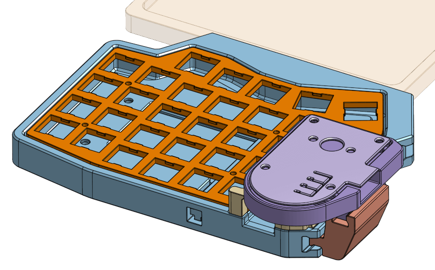
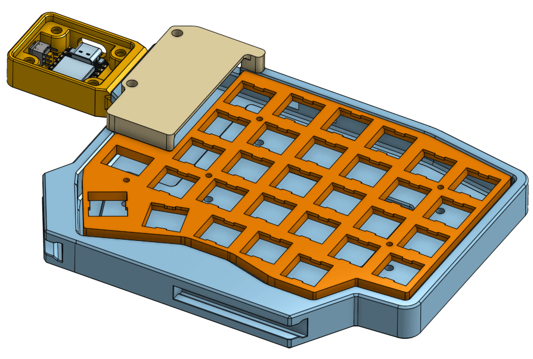
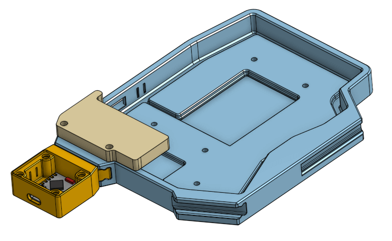
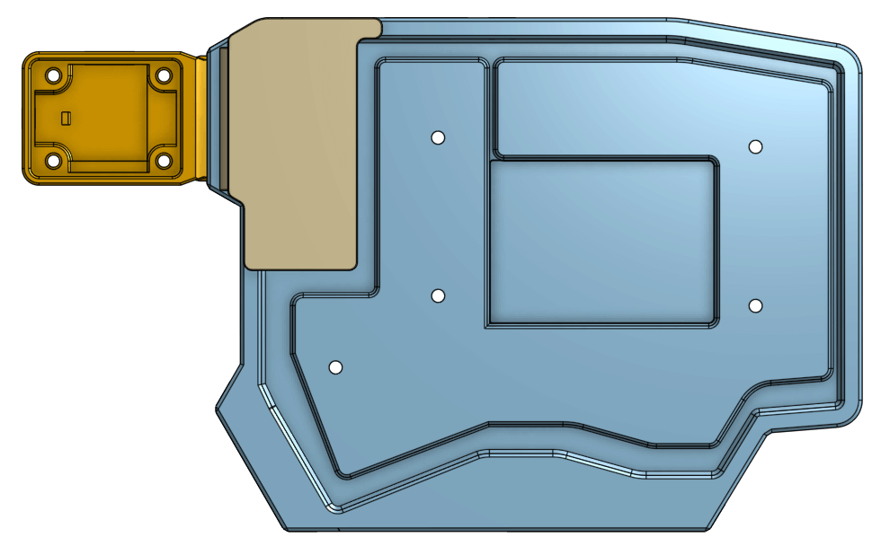
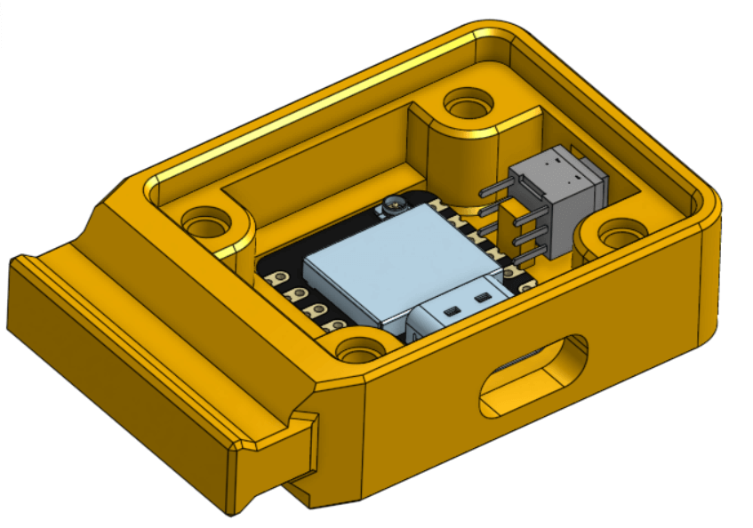

# Sofle v1 Modular Case

This case is designed to be used wirelessly. If you need the cutout for TRRS connector, there's a small dent near its position on the case wall. Simply edit the file to make the dent go all the way through the other side to create a hole.

For the case, it is designed to hold a **503450 Li-Po** 3.7v battery (~ 1000mAh). There's no mechanism to lock it in place, so you need to tape it down to the case. The case has 2 cutout on the top edge for placing a [19.6x5.5 power switch](img/power_switch_footprint.jpg) and a 6x6x6 reset button.

The joystick module is designed to hold a **[KY-023](https://arduinomodules.info/ky-023-joystick-dual-axis-module/)** module and an **ESP-32 S3 Zero**/Super Mini board. You can find the footprint image [here](img/esp32-zero-footprint.jpg). The board can be powered and connect directly via the USB port, or for variants that support 3.7v battery like [this one](https://vn.shp.ee/Lcttqmr), you can place inside the case a small Li-Po battery (501230 will probably fit) and connect both to a power switch.

The gap between the module's rail and the case's connector is 0.1mm. If you find that they do not fit properly, you can adjust the size of the rail by editing the .stl file, or make a copy of my Onshape project [here](https://cad.onshape.com/documents/8e4b67d99ebe6a9953b51236/w/fc37eb56f099d0099efda1f7). The sketch is placed inside `Case/Slide Rail` folder for the case's connector, and `Joystick Module/Rail` for the module's rail.

List of screws and spacers needed for each side:

-   5x M2x8mm spacer for the case.[^1]
-   5x M2x8mm screws for the case.
-   5x M2x4mm screws for the top plate.[^2]
-   3x M2x10mm for the MCU cover.[^3]
-   4x M3x4mm screws for the joystick module.[^4]

[^1]: This can be adjust based on the thickness of your battery. The recommended minimum height is 7mm, but 6mm seems to also work.
[^2]: The distance between the bottom side and the top side where the spacer is placed is 5mm ([image](./img/06.png)). Adjust the length of the screw based on the height of your spacer.
[^3]: Maximum length is 12mm.
[^4]: Maximum length is 10mm.

