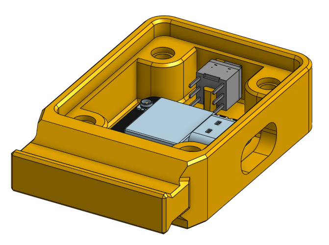
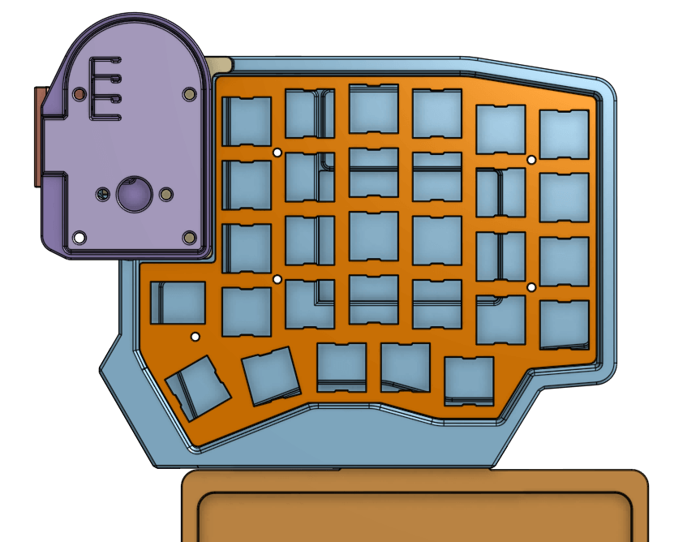
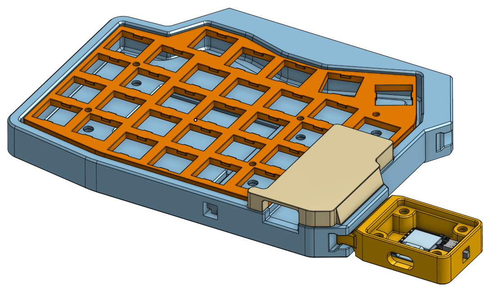
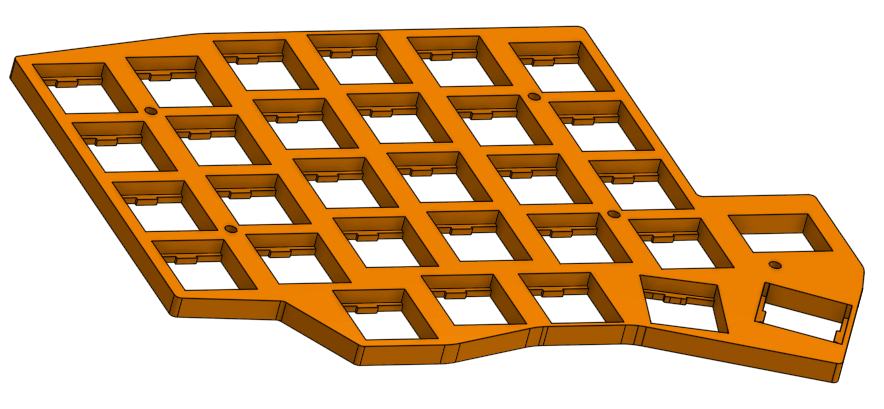

# Sofle v1 Modular Case


## Case

This case is designed to be used wirelessly. If you need the cutout for TRRS connector, there's a small dent near its position on the case wall. Simply edit the file to make the dent go all the way through the other side to create a hole.

For the case, it is designed to hold a **503450 3.7v Li-Po** battery (~1000mAh). There's no mechanism to hold it in place, so you need to tape it down to the case. The case has 2 cutout on the top edge for placing a [19.6x5.5 power switch](img/power_switch_footprint.jpg) and a 6x6x6 reset button.

## Top Plate

The plate has the thickness of 3mm. I also added the clips to snap the switches in. This plate support MX switches only.

## Modules

### Joystick



The joystick module case is designed to hold a **[KY-023](https://arduinomodules.info/ky-023-joystick-dual-axis-module/)** PCB and a **Xiao ESP32S3** board (other Xiao ESP32 should also fit since they have similar footprint). The board can be powered and connect directly via the USB port, or with a 3.7v battery for wireless connection (you can refer to this [image](img/08.png) for rough estimation of the size of the battery; the height of the battery should be less than 6mm). There's also a cutout for a 6x6x8 latching push button as a power switch for the Xiao if it is to be used with a battery.

> Note that the reading resolution of KY-023 by default is very low. This should be only used for moving between monitors or tasks that do not require precision movements.

### Trackpoint


The trackpoint module case is designed to hold a trackpoint breakout module. This module can be sourced from AliExpress. You can find it by searching for ["Rocker Trackpoint"](https://aliexpress.com/w/wholesale-rocker-trackpoint.html). [Example product link](https://aliexpress.com/item/1005006403709759.html). This module came with a USB cable. You can desolder the cable and replace it with a female Type C breakout board for better portability.

The orientation of the module is reversed by default for better ergonomics. To revert the mouse movement:

-   For Windows, you can use an AHK script like [this SuperUser answer](https://superuser.com/a/1067929), or use a separate software like the one provided from [this SuperUser answer](https://superuser.com/a/406865).
-   For Linux (X server), you can run:

    ```bash
    # Get the device ID.
    xinput list

    # Set the transformation matrix. Replace $device_id with the device ID you got from the previous command.
    xinput set-prop $device_id "Coordinate Transformation Matrix" -1 0 1 0 -1 1 0 0 1

    # To revert the change, run:
    # xinput set-prop $device_id "Coordinate Transformation Matrix" 1 0 0 0 1 0 0 0 1
    ```

-   I don't use Wayland nor macOS personally so I cannot provide a verified solution.

### 90-degree Adapter


## Parts

### Case

| Part               | Quantity | Notes                           |
| ------------------ | -------- | ------------------------------- |
| M2x6mm screw       | 20       | [Reference](img/screw_m2.jpeg)  |
| M2x8mm spacer      | 10       | Minimum 6mm                     |
| M2x4mm heat insert | 10       | [Reference](img/insert_m2.jpeg) |
| 10x5x2mm magnet    | 8        |                                 |

### Joystick Module

| Part               | Quantity | Notes                                         |
| ------------------ | -------- | --------------------------------------------- |
| M3x6mm screw       | 4        | [Reference](img/screw_m3.jpeg)                |
| M3x6mm heat insert | 4        | [Reference](img/insert_m3.jpeg); Maximum 10mm |

### Trackpoint Module

| Part                 | Quantity | Notes                                       |
| -------------------- | -------- | ------------------------------------------- |
| M2.5x6mm screw       | 2        | [Reference](img/screw_m25.jpeg) (optional)  |
| M2.5x4mm heat insert | 2        | [Reference](img/insert_m25.jpeg) (optional) |
| M3x6mm screw         | 4        | [Reference](img/screw_m3.jpeg)              |
| M3x4mm heat insert   | 4        | [Reference](img/insert_m3.jpeg)             |

## Images

You can find more images in the [img](img) folder.







