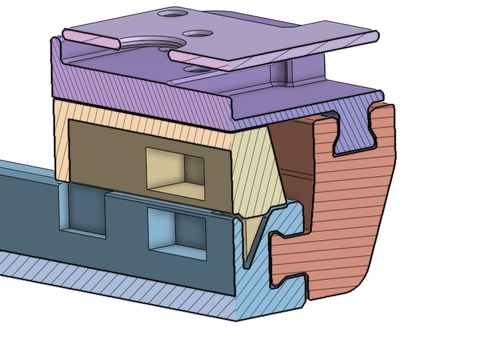

# Sofle v1 Modular Case


## Table of Contents

-   [Case](#case)
-   [Top Plate](#top-plate)
-   [Modules](#modules)
    -   [Joystick](#joystick)
    -   [Trackpoint](#trackpoint)
    -   [90-degree Adapter](#90-degree-high-profile-adapter)
    -   [Wrist Rest Holder](#wrist-rest-holder)
-   [Parts](#parts)
    -   [Case (both halves)](#case-both-halves)
    -   [Joystick Module](#joystick-module)
    -   [Trackpoint Module](#trackpoint-module)
-   [Images](#images)

## Case

The case is designed to be used wirelessly. If you need the cutout for TRRS connector, there's a small dent near its position on the case wall. Simply edit the file to make the dent go all the way through the other side to create a hole.

The case is designed to hold a **503450 3.7v Li-Po** battery (~1000mAh). There's no mechanism to fixed it in place, so you need to tape it down to the case. The case has a cutout on the top edge for placing a 6x6 reset button. There's no cutout for a power switch since I will be utilizing ZMK's [Soft-off](https://zmk.dev/docs/features/soft-off) feature, which a reset button is sufficient to wake the keyboard up.

[:arrow_up:](#table-of-contents)

## Top Plate


The plate has the thickness of 3mm. I also added the clips to snap the switches in. This plate support MX switches only.

[:arrow_up:](#table-of-contents)

## Modules

### Joystick


The joystick module case is designed to hold a **[KY-023](https://arduinomodules.info/ky-023-joystick-dual-axis-module/)** PCB and a **Xiao ESP32S3** board (other Xiao ESP32 should also fit since they have similar footprint). The board can be powered and connect directly via the USB port, or with a 3.7v battery for wireless connection (you can refer to this [image](img/08.png) for rough estimation of the size of the battery; the height of the battery should be less than 6mm). There's also a cutout for a 6x6x10 latching push button as a power switch for the Xiao if it is to be used with a battery.

> Note that the reading resolution of KY-023 by default is very low. This should be only used for moving between monitors or tasks that do not require precise movements.

[:arrow_up:](#table-of-contents)

### Trackpoint


The trackpoint module case is designed to hold a trackpoint breakout module. This module can be sourced from AliExpress. You can find it by searching for [_"Rocker Trackpoint"_ (search)](https://aliexpress.com/w/wholesale-rocker-trackpoint.html). [Example product link](https://aliexpress.com/item/1005006403709759.html) (**disclaimer**: I did NOT buy mine from AliExpress but via a local e-commerce platform). This module came with a USB cable. You can use rubbing alcohol to remove the hot glue, and desolder the cable to replace it with a female Type C breakout board for better portability. [Image](img/rocker_trackpoint_module_modded.jpg) of the one I modded.

This module is designed to be used with the [90-degree high-profile adapter](#90-degree-high-profile-adapter) mounted on the right half. The orientation of the module is reversed for better ergonomics. To revert the mouse movement, you can either mount the module to the left side of the case, or by using software solutions:

-   For Windows, you can use an AHK script like [this SuperUser answer](https://superuser.com/a/1067929), or use a separate software like the one provided from [this SuperUser answer](https://superuser.com/a/406865).
-   For Linux (X server), you can run:

    ```bash
    # Get the device ID.
    xinput list

    # Set the transformation matrix. Replace $device_id with the device ID you got from the previous command.
    xinput set-prop $device_id "Coordinate Transformation Matrix" -1 0 1 0 -1 1 0 0 1

    # To revert the change, run:
    # xinput set-prop $device_id "Coordinate Transformation Matrix" 1 0 1 0 1 1 0 0 1
    ```

-   I don't use Wayland nor macOS personally, thus cannot provide a verified solution.

[:arrow_up:](#table-of-contents)

### Trackball

> I don't prefer the use of trackball, therefore don't have any plan to design a module for it. There's plenty of designs available on the internet, so you can use them as a reference to design your own.

[:arrow_up:](#table-of-contents)

### 90-degree High-Profile Adapter


Designed to be used at the top corner rail.

[:arrow_up:](#table-of-contents)

### Wrist Rest Holder


This is a simple design for holding a rectangular gel wrist rest. The inner size of the provided one is 130x85mm. This part is fully parametric, so you can adjust the size to fit your need.

[:arrow_up:](#table-of-contents)

## Parts

### Case (both halves)

| Part                | Quantity | Notes                                              |
| ------------------- | -------- | -------------------------------------------------- |
| M2, 12mm screw      | 20       | [Reference](img/screw_m2.jpeg)                     |
| M2, 3mm stand-off   | 10       | Adjust based on the thickness of your battery.     |
| M2, 4mm heat insert | 10       | [Reference](img/insert_m2.jpeg)                    |
| 10x5x5mm magnet     | 8        | 2 for each half of the case, 2 for each MCU cover. |
| 6x6mm reset button  | 2        | [Reference](img/6x6_button.jpeg)                   |

> For the 6x6mm reset button, I use the 4.3mm height variant. Variants that are thicker than 6mm may protrude too much from the case.

### Joystick Module

| Part                | Quantity | Notes                                         |
| ------------------- | -------- | --------------------------------------------- |
| M3, 6mm screw       | 4        | [Reference](img/screw_m3.jpeg)                |
| M3, 6mm heat insert | 4        | [Reference](img/insert_m3.jpeg); Maximum 10mm |

### Trackpoint Module

| Part                | Quantity | Notes                           |
| ------------------- | -------- | ------------------------------- |
| M2, 6mm screw       | 6        | [Reference](img/screw_m2.jpeg)  |
| M2, 4mm heat insert | 6        | [Reference](img/insert_m2.jpeg) |

[:arrow_up:](#table-of-contents)

## Images

You can find all images in the [img](img) folder.




[:arrow_up:](#table-of-contents)
