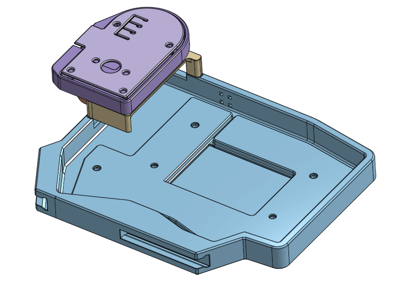
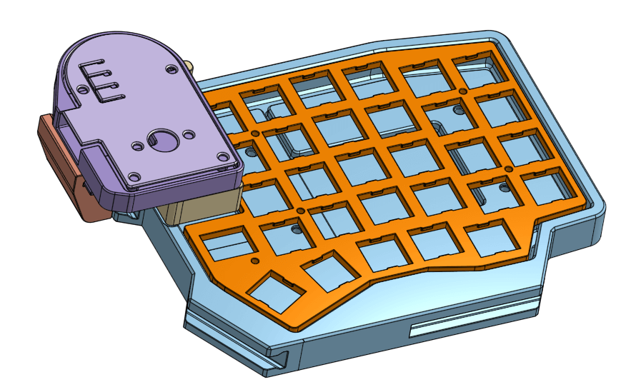

# Sofle v1 Modular Case

This case is designed to be used wirelessly. If you need the cutout for TRRS connector, there's a small dent near its position on the case wall. Simply edit the file to make the dent go all the way through the other side to create a hole.

For the case, it is designed to hold a **503450 Li-Po** 3.7v battery (~ 1000mAh). There's no mechanism to lock it in place, so you need to tape it down to the case. The case has 2 cutout on the top edge for placing a [19.6x5.5 power switch](img/power_switch_footprint.jpg) and a 6x6x6 reset button.

The joystick module is designed to hold a **[KY-023](https://arduinomodules.info/ky-023-joystick-dual-axis-module/)** module and a **Xiao ESP32S3** board (other Xiao ESP32 should also fit since they have similar footprint). The board can be powered and connect directly via the USB port, or with a 3.7v battery for wireless connection (you can refer to this [image](img/08.png) for rough estimation of the size of the battery; the height of the battery should be less than 60mm). There's also a cutout for a 6x6x8 latching push button as a power switch for the Xiao if it is to be used with a battery.

The clearance between the rail lips (case) and connector (module) is 0.2mm. If you find that they do not fit properly, you can adjust the size of the rail connector on the module by making a copy of my Onshape project [here](https://cad.onshape.com/documents/8e4b67d99ebe6a9953b51236/w/fc37eb56f099d0099efda1f7) and edit it. The sketch is placed at `Joystick Module/Rail/Rail`.

List of screws and spacers needed for each side:

-   Case:
    -   5x M2x8mm spacer[^1]
    -   7x M2x4mm threaded insert. 5 for the bottom side[^2], 2 for MCU cover.
    -   5x M2x8mm screws
-   MCU cover:
    -   2x M2x4mm threaded insert
    -   2x M2x8mm screws[^3]
-   Joystick module:
    -   4x M2x4mm threaded insert
    -   4x M3x4mm screws
-   Other parts:
    -   5x M2x4mm screws for the top plate[^4]

[^1]: This can be adjust based on the thickness of your battery. The recommended minimum height is 7mm, but 6mm seems to also work.
[^2]: The height of the board from the bottom side to the top side where the screw goes out is 5mm. The countersink hole is 1mm deep. See [this image](https://github.com/itsdmd/sofle-v1-modular-case/blob/main/img/09.png). The second ring from the bottom is to help guide the threaded insert into the hole.
[^3]: 6mm might also work, 10mm is maximum.
[^4]: The distance between the bottom side and the top side where the spacer is placed is 5mm ([image](https://github.com/itsdmd/sofle-v1-modular-case/blob/main/img/06.png)). Adjust the length of the screw based on the height of your spacer.

